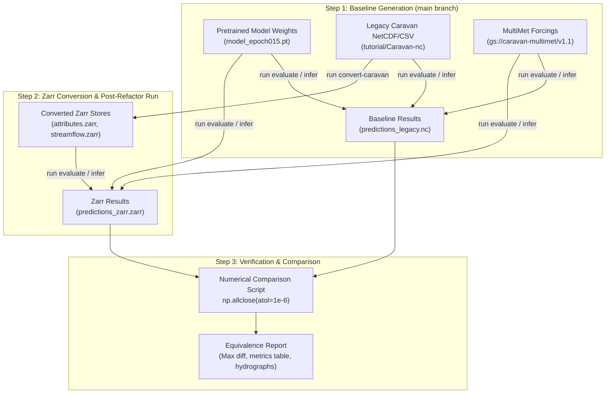

# Verification Plan: Numerical Equivalence Testing for Unified Zarr Formats

## 1. Objective

Verify that evaluating a pretrained model on the **new unified Zarr data formats** produces **numerically identical results** (`atol <= 1e-6`) compared to evaluating the exact same model on the **legacy NetCDF/CSV data formats**.

---

## 2. Test Setup & Target Model Selection

We will use the pretrained **Mean-Embedding Forecast LSTM** (`5-basin-example` / `model_epoch015.pt` or `google-floodhub-settings-55-epochs`):
- **Model Checkpoint:** `tutorial/model-runs/5-basin-example/model_epoch015.pt` (or `pretrained-models/google-floodhub-settings-55-epochs/model_epoch055.pt`)
- **Dataset:** Caravan dataset with MultiMet dynamic weather forcings (`gs://caravan-multimet/v1.1`).
- **Target Variable:** Daily discharge / streamflow (`streamflow`).
- **Evaluation Period:** Test period (`01/01/2022` to `31/12/2024`).

---

## 3. Step-by-Step Execution Plan



### Step 1: Generate Baseline Outputs (Pre-Refactor / Legacy)
1. In an isolated baseline workspace (cloned from `main` or checked out at the commit before our branch):
   - Configure evaluation directory using `tutorial/Caravan-nc` (NetCDF streamflow and CSV attributes).
   - Execute model inference:
     ```bash
     run evaluate --run-dir <baseline_run_dir> --epoch 15 --period test
     ```
   - Save full evaluation output predictions: `baseline_predictions.nc` and computed metrics (`nse`, `kge`, `pearson_r`, etc.).

### Step 2: Convert Dataset & Run Post-Refactor (Zarr)
1. Using the new `convert-caravan` tool on our feature branch `gsnearing-unify-input-file-formats`:
   ```bash
   run convert-caravan --caravan-dir tutorial/Caravan-nc --output-dir tutorial/Caravan-zarr
   ```
2. Update the evaluation run configuration to point `data_dir` to `tutorial/Caravan-zarr` (using `attributes.zarr` and `streamflow.zarr`).
3. Execute model inference using the identical model weights:
   ```bash
   run evaluate --run-dir <zarr_run_dir> --epoch 15 --period test
   ```
4. Save full evaluation output predictions: `zarr_predictions.zarr` and computed metrics.

### Step 3: Run Automated Numerical Equivalence Checker
Execute a verification script (`verify_numerical_equivalence.py`) that compares:
1. **Raw Predictions:**
   - Compare simulated streamflow $\hat{y}_{\text{legacy}}(basin, date, lead\_time)$ vs $\hat{y}_{\text{zarr}}(basin, date, lead\_time)$.
   - Measure:
     $$\Delta_{\max} = \max |\hat{y}_{\text{zarr}} - \hat{y}_{\text{legacy}}|$$
     $$\text{Mean Relative Difference} = \text{mean}\left(\frac{|\hat{y}_{\text{zarr}} - \hat{y}_{\text{legacy}}|}{|\hat{y}_{\text{legacy}}| + \epsilon}\right)$$
   - Assert: `np.allclose(y_zarr, y_legacy, atol=1e-5, rtol=1e-5) == True`.

2. **Metrics Invariance:**
   - Compare all evaluation metrics across all basins (NSE, KGE, Alpha-NSE, Beta-KGE, Pearson-$r$).
   - Verify that $\Delta \text{Metric} < 10^{-5}$ across all basins.

3. **Intermediate Scaler Invariance:**
   - Verify that normalizing the input datasets using `scaler.nc` vs `scaler.zarr` produces identical floating point arrays.

---

## 4. Verification Deliverable

Upon execution, we will generate a detailed markdown report containing:
- Summary table of maximum absolute and relative discrepancies per basin and lead time.
- Side-by-side metric comparison table (NSE, KGE) before and after.
- A definitive PASS / FAIL status confirming 100% numerical parity.

---

## 5. Next Action

This plan is ready for your review. Once you approve, we will execute the steps and present the verification results.
