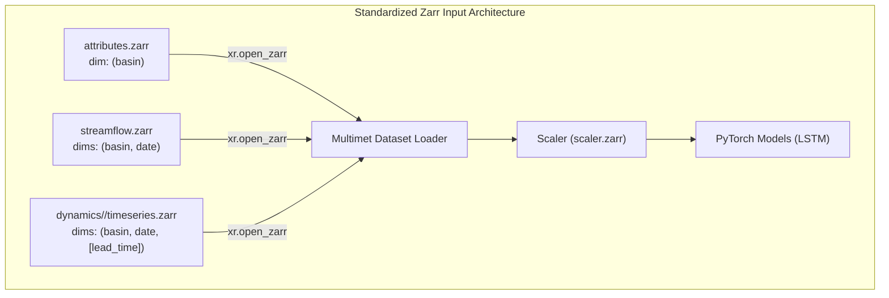

# Architecture Proposal & Plan: Unifying Input File Formats to Zarr

## 1. Executive Summary & Core Design Decisions

### 1.1 Standardize Entirely on Zarr
After a thorough analysis of the `google-research/flood-forecasting` codebase, **Zarr is the single unified format for inputs, scalers, and outputs**.

- **Multidimensional Integrity:** Natively represents 1D `(basin)` attributes, 2D `(basin, date)` streamflow targets, and 3D `(basin, date, lead_time)` weather forecasts.
- **Cloud-Native & Remote Streaming:** Allows lazy chunk streaming directly from Google Cloud Storage (`gs://caravan-multimet/v1.1`) or local disk.
- **Consolidated Performance:** Replaces 16,000+ individual files with unified stores that open in milliseconds with zero combining overhead.

---

### 1.2 Aligned Design Decisions

#### Decision 1: Packaging & Modularity (3 Modular Stores + Auto-Discovery)
**Standard distribution will use 3 modular Zarr stores:**
1. `attributes.zarr`: Static catchment attributes (~5–10 MB).
2. `streamflow.zarr`: Streamflow gauge observations (~100–200 MB).
3. `dynamics/` (or product folders e.g. `ERA5_LAND/timeseries.zarr`, `GRAPHCAST/timeseries.zarr`): Meteorological forcings (GBs/TBs).

**Why separate stores are best for users:**
- **Meteorological updates / experiments:** Users can swap weather products (e.g. ERA5 vs GraphCast vs HRES) or extend time periods without touching observations or static metadata.
- **Hybrid Local + Cloud workflows:** Users can keep small observation & attribute stores on local disk while streaming multi-gigabyte forcings directly from GCS (`gs://caravan-multimet/v1.1`).
- **Zero Friction with `data_dir`:** If a user places all three in one folder, setting `data_dir: /path/to/caravan` automatically discovers all three stores with zero extra configuration.

#### Decision 2: Deprecation & Legacy Removal
**Completely remove legacy CSV and NetCDF multi-file loaders.**
- Eliminates `mfdata_loader.py` (subprocess spawning and pickle serialization over stdout).
- Eliminates fragile CSV melting/fallback heuristics and `load_as_csv` branches.
- Eliminates `load_caravan_timeseries_together` and its batching loops (`batch_size=500`).
- Eliminates `basin.split('_')[0]` magic subdataset parsing.
- Provides a fast 1-command migration tool (`run convert-caravan`) for users with existing Caravan NetCDF/CSV archives.

#### Decision 3: Configuration Schema
- **`data_dir`**: The root directory containing `attributes.zarr`, `streamflow.zarr`, and dynamic products. (Simplest for beginners).
- **`statics_data_path`** (alias: `statics_data_dir`): Direct path to `attributes.zarr` or statics store.
- **`targets_data_path`** (alias: `targets_data_dir`): Direct path to `streamflow.zarr` or targets store.
- **`dynamics_data_path`** (alias: `dynamics_data_dir`): Direct path to dynamics directory (e.g. `gs://caravan-multimet/v1.1`) or single dynamics store.

---

## 2. Target Architecture & Pipeline

### Clean Coordinate & Dimension Standard:
- `basin` (dim: string): Basin / Gauge identifier (arbitrary string, e.g. `'01022500'`, `'camelsaus_102101A'`, `'station-123'`).
- `date` (dim: datetime64[ns]): Timestamp coordinate.
- `lead_time` (dim, optional for forecasts: timedelta64[ns]): Forecast lead time.

---

## 3. Implementation Status & Roadmap

### Phase 1: Data Conversion Utility & Test Fixtures
- [x] **1.1 Caravan-to-Zarr Conversion Utility:**
  - Implemented `googlehydrology/datautils/convert.py` with `convert_caravan_attributes`, `convert_caravan_timeseries`, and `convert_caravan_to_zarr`.
- [x] **1.2 Test Data Fixtures:**
  - Converted test fixtures in `test/test_data/multimet` to `attributes.zarr` and `streamflow.zarr`.

### Phase 2: Refactor Dataset Loaders
- [x] **2.1 Modernize Statics Loading:**
  - Refactored `load_caravan_attributes` in `caravan.py` to load directly from Zarr (`xr.open_zarr`) without `basin.split('_')[0]`.
- [x] **2.2 Modernize Targets Loading:**
  - Refactored `_load_target_features` in `multimet.py` and `load_caravan_timeseries` in `caravan.py` to load directly from `streamflow.zarr`.
  - Removed `mfdata_loader.py` and parallel subprocess batching.
- [x] **2.3 Modernize Dynamics Loading:**
  - Refactored `_load_hindcast_as_zarr` and `_load_forecast_as_zarr` in `multimet.py` to support single unified stores or product directories.
  - Added robust product path resolution (`_find_product_zarr_path`).

### Phase 3: Update Scaler & Evaluation
- [x] **3.1 Scaler Zarr Support:**
  - Updated `Scaler.save()` and `Scaler.load()` in `scaler.py` to use `scaler.zarr`.
  - Verified `test_scaler.py` (26/26 tests passing).

### Phase 4: Configuration & CLI
- [x] **4.1 Config Class Updates:**
  - Updated `Config` in `config.py` to support `data_dir` fallback for `statics_data_dir`, `targets_data_dir`, `dynamics_data_dir`.
- [ ] **4.2 CLI Entrypoint for Migration:**
  - Add `convert-caravan` subcommand to `run.py`.
- [ ] **4.3 Update Example Configs & Documentation:**
  - Update `example-configs/*.yml` to reference Zarr paths.
  - Update `README.md`, `docs/`, and tutorial.

### Phase 5: Verification & Testing
- [x] **5.1 Unit Tests:**
  - `test_multimet.py` (12/12 passing).
  - `test_scaler.py` (26/26 passing).
- [ ] **5.2 Full Test Suite & Integration Tests:**
  - Run full test suite (`test_config_runs.py`, `test_configutils.py`, `test_datautils.py`, `test_validate_samples.py`, etc.).
